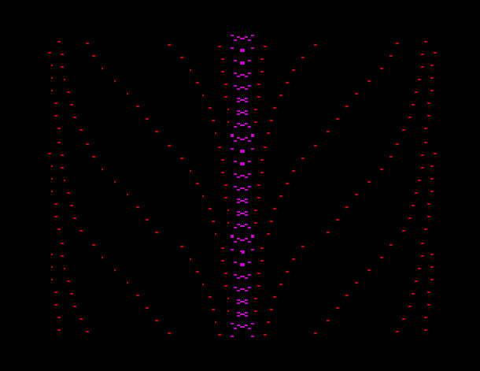

# BRAIN WAVES
256 bytes intro
1st place @Speccy.pl Party 2019.1
## Tech
* ZX Spectrum 48
* Z80 Assembler ( <=256 bytes executable size)
## Screenshot

## Controlls
* Kempston OR Sinclair 1 / Keyboard (keys 1,2,3,4)
## Build instruction
* Use Pasmo to build (compile.sh for MacOS)

## Authors
* **Tomasz Słanina** - [dox/Joker](https://github.com/tslanina)
## License
This project is licensed under the GPL v3 License - see the [LICENSE](LICENSE) file for details
